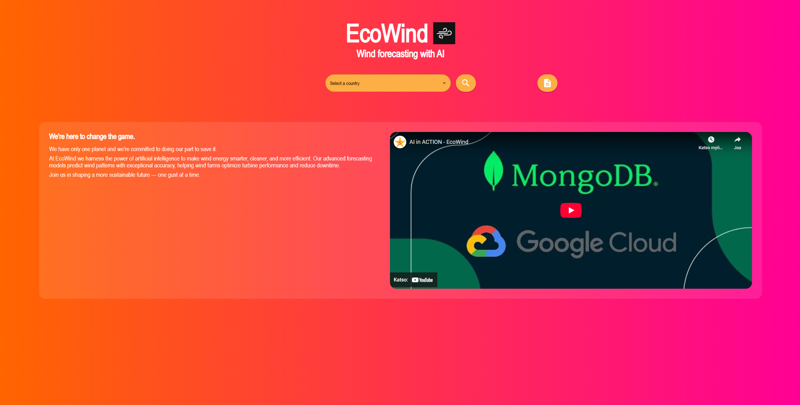
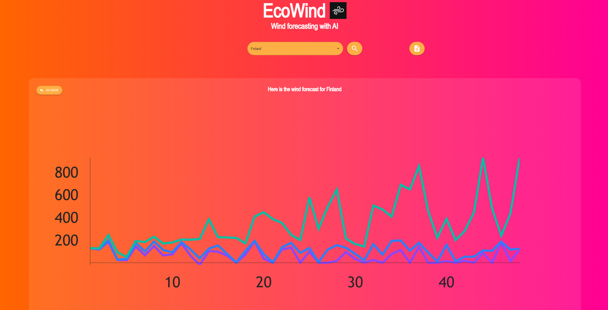
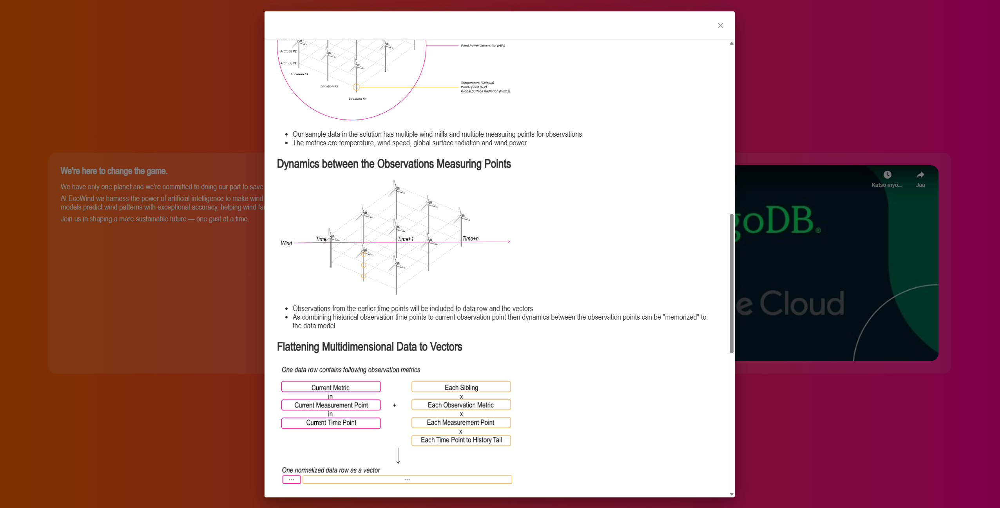

# EcoWind
### // React, Material UI

EcoWind is a wind prediction platform developed as part of the AI in Action competition. Our multidisciplinary team aimed to combine AI, real-world wind turbine data, and modern web technologies to forecast wind behavior up to 48 hours into the future. Wind energy plays a crucial role in the global transition to sustainable power. With better wind forecasts, energy companies can optimize turbine performance and grid integration. EcoWind provides solution that is both scalable and practical.

## Overview

EcoWind uses wind turbine data to predict future wind conditions. These predictions are powered by AI models that leverage vector search techniques to find patterns in time-series data, enabling more accurate short-term forecasting.

  

## Key Technologies

- Artificial Intelligence (AI) — for analyzing and predicting wind behavior
- Google Cloud API — for scalable processing and cloud-based data access
- MongoDB — for storing and querying large datasets
- Vector Search — to enhance the AI model's ability to find similar wind patterns
- React & MUI (Material UI) — for building a responsive and intuitive user interface

## My Role

I was responsible for designing and implementing the frontend interface of EcoWind. The UI was built using React and styled with Material UI, focusing on clarity, usability, and real-time data visualization.

  

## Live Demo

Check out the live web application here:
[EcoWind]([https://aiinaction-dev-a6dcbwf3aea0gxcv.swedencentral-01.azurewebsites.net/])

## Team Repositories

Explore our team's code:
[Startecon github repo]([https://github.com/startecon/AIinAction/tree/main])

  

